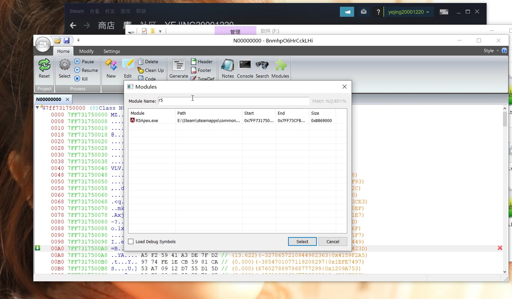

# handle_grant_access
句柄提权 无视反作弊读写游戏内存 用于分析游戏结构工具

# 测试图片(APEX)
<h1 align="center">
	
	 
</h1>

# 测试视频
https://www.ixigua.com/7001756524129288712?utm_source=xiguastudio

# 测试系统
Microsoft Windows [版本 10.0.18363.592]

# 原理
遍历进程句柄表,修改句柄权限为0x1fffff

